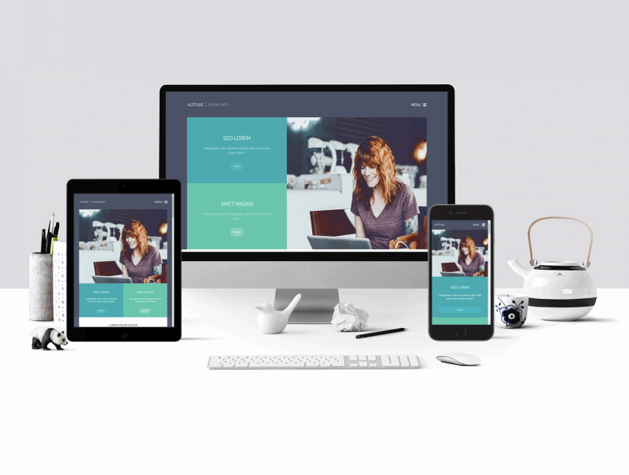

**ALTITUDE**

> This project was realized implementing responsive desing for all devices, starting with first mobile,
> is oriented to pixel perfect layout, it also handles what are CSS variables, it implements the methodology BEM,
> semantic and is focused a little to tests of web accessibility with lighthouse.

This is how the design was developed in the different devices
 

 

**IF YOU WANT TO SEE HOW THE APP WORKS ENTER THIS LINK:**
 
https://dianyelamaldonado.github.io/ALTITUDE-responsive-desing/src/
 

| **Tools and technologies used in the app** |
| :----------------------------------------: |
|                    HTML                    |
|                    CSS                     |
|               CSS variables                |
|                Materialize                 |
|                Git & Github                |
|              BEM methodology               |

The prototype I implemented for the practice I took from: (https://pixelarity.com/)

---

**ALTITUDE**

> Este proyecto fue realizado implementando responsive desing para todos los dispositivos, iniciando con first mobile,
> está oriendado a maquetación pixel perfect, tambien se manejan lo que son variables de CSS, se implementa la metodología BEM, semántica y está enfocado un poco a pruebas de accesibilidad web con lighthouse.

Así se ve en diferentes dispositivos
 

 

**SI QUIERES VER CÓMO FUNCIONA LA APP ENTRA A ESTE LINK:**
 
https://dianyelamaldonado.github.io/ALTITUDE-responsive-desing/src/
 

| **Herramientas y tecnologías usadas en la app** |
| :---------------------------------------------: |
|                      HTML                       |
|                       CSS                       |
|                Variables de CSS                 |
|                   Materialize                   |
|                  Git & Github                   |

|Metodología BEM°
El prototipo que implementé para la práctica lo saqué de: (https://pixelarity.com/)
